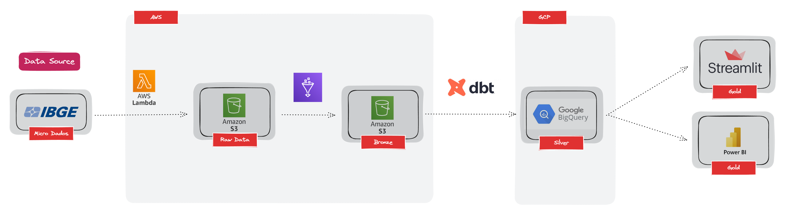

# Micro Dados IBGE

Preciso de um script em python para abrir e transformar os microdados do IBGE e criar tabelas relacionais num banco de dados (AWS-RDS de preferência)

Documentações nos links abaixo:

- [Censo 2010](https://www.ibge.gov.br/estatisticas/sociais/trabalho/22827-censo-demografico-2022.html?=&t=microdados)
- [Censo 2000](https://www.ibge.gov.br/estatisticas/sociais/populacao/9127-pesquisa-nacional-por-amostra-de-domicilios.html?=&t=microdados)

## Arquitetura da solução



## Estrutura do repositorio
``` 
├── ingestion
    ├── micro-dados-2000.py
    ├── micro-dados-2010.py
├── transform
├── Dockerfile
├── requirements.txt
├── .env
├── README.md
└── links.json
```

## Como rodar
### Ingestion
A ingestão dos dados é feita via docker pela imagem oficial da AWS Lambda.

Para subir o docker é necessario o comando abaixo:

```bash

docker run -p 9000:8080 lambda-micro-dados:v2

```


Para executar os scripts, necessario o comando abaixo:

```bash

Invoke-WebRequest -Uri "http://localhost:9000/2015-03-31/functions/function/invocations" -Method Post -Body '{}' -ContentType "application/json"

```
Para mais informações ou duvidas:
[AWS Lambda](https://docs.aws.amazon.com/lambda/latest/dg/python-image.html)

### Transform
O script foi pensando para rodar em um cluster de AWS Glue.

## Anotações

Por motivos de estudos, vou migrar o banco AWS-RDS para o BigQuery do Google, e realizar alguns processamentos em dbt cloud e visualização de dados no python.

## Desafios encontrados nesse trabalho:
- Nuvem AWS
- Compreensão dos dados do IBGE
- Big Data
