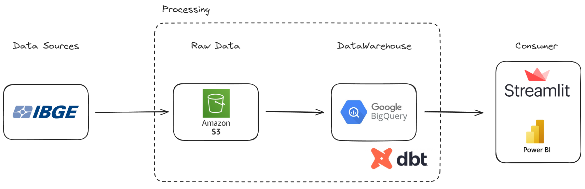

# micro-dados-ibge

Preciso de um script em python para abrir e transformar os microdados do IBGE e criar tabelas relacionais num banco de dados (AWS-RDS de preferência)

Documentações nos links abaixo:

https://www.ibge.gov.br/estatisticas/sociais/trabalho/22827-censo-demografico-2022.html?=&t=microdados

https://www.ibge.gov.br/estatisticas/sociais/populacao/9127-pesquisa-nacional-por-amostra-de-domicilios.html?=&t=microdados

Obs.: Descrição feita a partir de um freela que encontrei na internet.

## Estrutura

## Anotações

Por motivos de estudos, vou migrar o banco AWS-RDS para o BigQuery do Google, e realizar alguns processamentos em dbt cloud e visualização de dados no python.

## Desafios encontrados nesse trabalho:
- Estudo sobre o AWS-RDS e nuvem AWS
- Compreensão dos dados do IBGE
- Big Data
